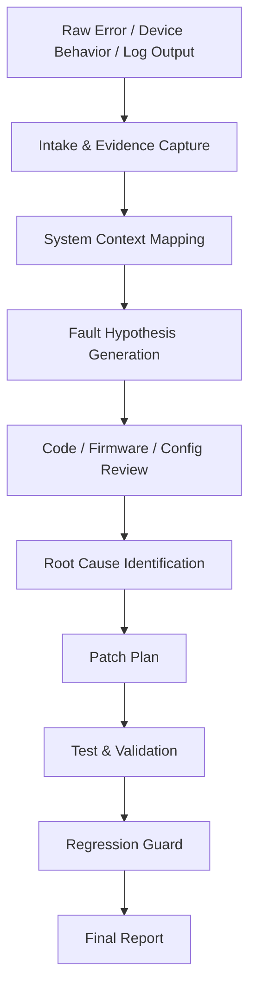
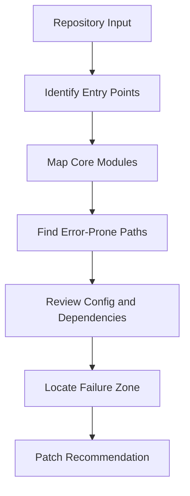
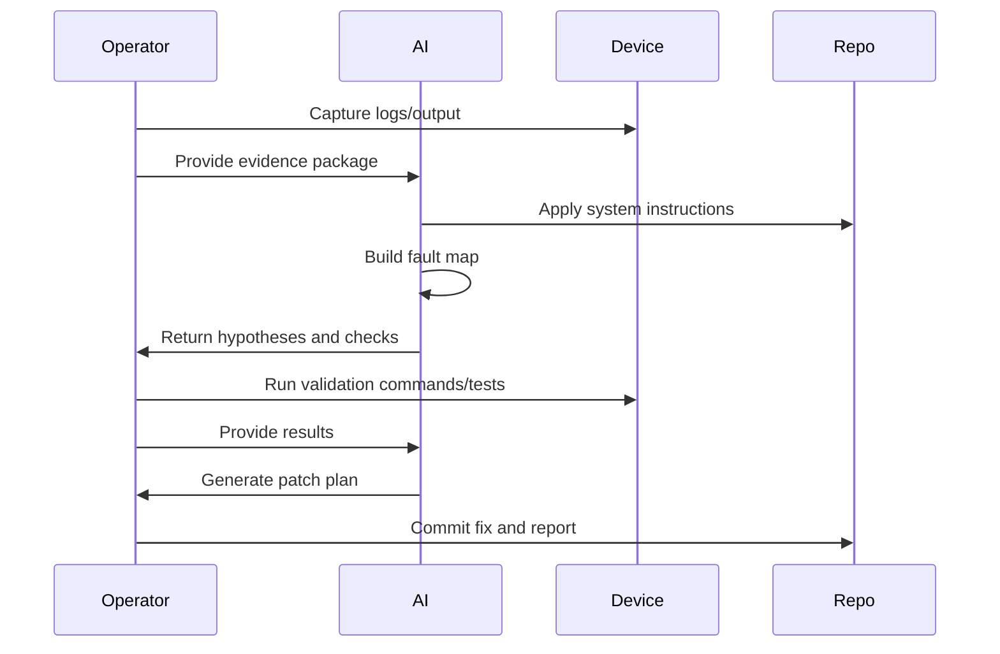

# FirmwareForensics

> **Map the fault. Trace the cause. Generate the patch.**


---

## Overview

**FirmwareForensics** is a private AI-assisted reverse engineering, diagnostics, and repair-instruction repository designed for analyzing open-source devices, firmware, scripts, tools, logs, and system behavior with precision.

This repository does **not** exist to casually store prompts.

It exists to become an internal operating system for structured technical investigation.

FirmwareForensics helps transform messy debugging sessions, firmware issues, unexplained errors, device behavior, logs, and source-code problems into a disciplined workflow for:

- fault discovery
- root-cause analysis
- reverse engineering
- patch planning
- regression prevention
- documentation
- repeatable automation

---

## Mission

FirmwareForensics is built to reduce the time wasted manually reading through code, logs, firmware behavior, and device outputs line by line.

Instead, it provides a structured library of system instructions, prompts, workflows, checklists, and templates that guide AI systems through disciplined technical analysis.

The goal is simple:

> **Turn unknown system behavior into mapped evidence, clear reasoning, and validated fixes.**

---

## Core Purpose

FirmwareForensics is designed for private use across open-source and personally owned systems such as:

- ESP32 firmware projects
- Raspberry Pi services and scripts
- Flipper Zero firmware and modules
- Arduino and PlatformIO projects
- Python automation tools
- Linux services
- Dockerized tools
- CLI applications
- embedded-device logs
- open-source security utilities
- custom hardware/software experiments

It acts as a reusable instruction layer for AI-assisted reverse engineering and debugging.

---

## Operating Doctrine

FirmwareForensics follows a simple investigative doctrine:



The repo is built around the belief that troubleshooting should be:

| Principle | Meaning |
|---|---|
| **Evidence-first** | Never guess before collecting context |
| **Traceable** | Every conclusion should map back to logs, code, config, or observed behavior |
| **Repeatable** | Every workflow should be reusable across future devices and tools |
| **Patch-oriented** | Diagnosis is incomplete until it produces a safe fix path |
| **Regression-aware** | Every fix should include a way to prevent the issue from returning |
| **Operator-controlled** | AI assists the investigation, but the human operator owns decisions |

---

## What This Repo Contains

```text
FirmwareForensics/
├── README.md
├── SYSTEM.md
├── instructions/
│   ├── reverse-engineering-analyst.md
│   ├── firmware-debugger.md
│   ├── hardware-diagnostics.md
│   ├── patch-planner.md
│   └── report-generator.md
├── prompts/
│   ├── log-analysis.md
│   ├── source-code-triage.md
│   ├── firmware-error-trace.md
│   ├── dependency-review.md
│   └── regression-test-generation.md
├── workflows/
│   ├── intake-checklist.md
│   ├── fault-map-workflow.md
│   ├── patch-validation-workflow.md
│   └── release-review-workflow.md
├── templates/
│   ├── issue-report-template.md
│   ├── root-cause-analysis.md
│   ├── patch-plan.md
│   └── test-report.md
└── examples/
    ├── esp32-debug-session.md
    ├── raspberry-pi-service-error.md
    └── flipper-zero-firmware-review.md
```

---

## Repository Architecture

```mermaid
flowchart TD
    A[FirmwareForensics] --> B[SYSTEM.md]
    A --> C[instructions/]
    A --> D[prompts/]
    A --> E[workflows/]
    A --> F[templates/]
    A --> G[examples/]

    C --> C1[reverse-engineering-analyst.md]
    C --> C2[firmware-debugger.md]
    C --> C3[hardware-diagnostics.md]
    C --> C4[patch-planner.md]
    C --> C5[report-generator.md]

    D --> D1[log-analysis.md]
    D --> D2[source-code-triage.md]
    D --> D3[firmware-error-trace.md]
    D --> D4[dependency-review.md]
    D --> D5[regression-test-generation.md]

    E --> E1[intake-checklist.md]
    E --> E2[fault-map-workflow.md]
    E --> E3[patch-validation-workflow.md]
    E --> E4[release-review-workflow.md]

    F --> F1[issue-report-template.md]
    F --> F2[root-cause-analysis.md]
    F --> F3[patch-plan.md]
    F --> F4[test-report.md]
```



---

## Primary Capabilities

### 1. Reverse Engineering Assistance

FirmwareForensics provides structured instructions for analyzing how a system works from the outside inward.

Useful for:

- understanding unfamiliar open-source firmware
- mapping device boot behavior
- identifying hidden assumptions in code
- tracing control flow
- understanding hardware/software interaction
- documenting system architecture
- comparing expected behavior against observed behavior

---

### 2. Fault Mapping

Instead of treating an error as a random failure, FirmwareForensics breaks it into a traceable map.


A fault map should answer:

- What failed?
- Where did it fail?
- When did it fail?
- What changed before the failure?
- What logs or outputs support the conclusion?
- What component owns the failure?
- What is the safest patch path?
- How do we prove the fix worked?

---

### 3. Log Analysis

FirmwareForensics includes prompts for turning raw logs into structured intelligence.

Supported inputs may include:

- serial monitor output
- ESP32 boot logs
- Linux system logs
- Python stack traces
- Docker logs
- build errors
- compiler output
- network tool output
- firmware flashing errors
- device status reports

Standard log-analysis output:

```text
Symptom:
Evidence:
Relevant Lines:
Likely Cause:
Confidence:
Suggested Fix:
Validation Step:
Regression Risk:
```

---

### 4. Source Code Triage

FirmwareForensics is designed to help inspect unfamiliar codebases quickly and intelligently.

The goal is not to summarize files.

The goal is to determine:

- what matters
- what is broken
- what is risky
- what should be patched first
- what tests should exist
- what assumptions need verification



---

### 5. Firmware Debugging

FirmwareForensics is especially useful for embedded workflows involving:

- ESP32-C6
- ESP32-S3
- Arduino IDE
- PlatformIO
- Raspberry Pi GPIO
- serial devices
- UART/I2C/SPI devices
- battery-powered prototypes
- sensor modules
- wireless metadata tools
- firmware build errors

Common investigation areas:

| Area | Examples |
|---|---|
| **Boot issues** | reset loops, bootloader errors, flash problems |
| **Build failures** | missing libraries, sketch too large, board mismatch |
| **Peripheral issues** | I2C address errors, SPI pin conflicts, UART silence |
| **Power issues** | brownouts, unstable boost converter output |
| **Wireless issues** | scan failures, BLE instability, dropped packets |
| **Storage issues** | SD card mount failures, corrupted logs |
| **Memory issues** | heap exhaustion, PSRAM problems, stack overflow |

---

## Recommended Investigation Pattern



---

## Standard Workflow

### Step 1: Capture the Evidence

Collect the raw material first.

Examples:

```text
- device model
- board/chipset
- firmware version
- toolchain version
- error logs
- serial output
- wiring/pinout
- power source
- recent changes
- expected behavior
- actual behavior
```

---

### Step 2: Run the Intake Checklist

Use:

```text
workflows/intake-checklist.md
```

This creates a clean investigation package before deeper analysis begins.

---

### Step 3: Generate a Fault Map

Use:

```text
workflows/fault-map-workflow.md
```

The AI should convert raw evidence into:

- known facts
- unknowns
- likely failure zones
- dependencies
- testable hypotheses
- recommended next checks

---

### Step 4: Trace the Root Cause

Use the appropriate instruction profile:

```text
instructions/reverse-engineering-analyst.md
instructions/firmware-debugger.md
instructions/hardware-diagnostics.md
```

The goal is to narrow from broad possibilities to a specific cause.

---

### Step 5: Create a Patch Plan

Use:

```text
templates/patch-plan.md
```

Every patch plan should include:

- target file/component
- proposed change
- reason for change
- risk level
- rollback plan
- validation method
- regression test recommendation

---

### Step 6: Validate the Fix

Use:

```text
workflows/patch-validation-workflow.md
```

Validation should prove:

- the original issue is resolved
- no obvious new issue was introduced
- logs/output confirm expected behavior
- fix can be repeated
- future regression can be detected

---

## Instruction Profiles

### `reverse-engineering-analyst.md`

For understanding unfamiliar systems.

Focus:

- architecture mapping
- control flow
- behavioral inference
- dependency tracing
- function classification
- risk surface identification

---

### `firmware-debugger.md`

For embedded firmware and device-level issues.

Focus:

- boot logs
- board definitions
- pin mapping
- flash layout
- memory usage
- peripheral initialization
- radio/device behavior

---

### `hardware-diagnostics.md`

For physical device troubleshooting.

Focus:

- power path
- wiring
- voltage levels
- serial interfaces
- sensor connections
- battery/boost modules
- grounding
- noise and instability

---

### `patch-planner.md`

For producing safe, controlled fixes.

Focus:

- minimal-change patches
- rollback paths
- test coverage
- regression prevention
- risk classification
- implementation order

---

### `report-generator.md`

For turning investigations into clean documentation.

Focus:

- executive summary
- technical findings
- evidence
- impact
- remediation
- validation
- future recommendations

---

## Standard Investigation Report Format

Every serious investigation should produce this structure:

```md
# Fault Investigation Report

## Summary

## System Context

## Observed Behavior

## Expected Behavior

## Evidence Collected

## Timeline of Events

## Fault Map

## Root Cause Hypotheses

## Most Likely Root Cause

## Recommended Patch

## Validation Steps

## Regression Prevention

## Remaining Unknowns

## Final Notes
```

---

## Severity Model

FirmwareForensics uses a practical severity model.

| Severity | Meaning |
|---|---|
| **Critical** | Device/system unusable, unsafe, corrupting data, or causing repeated failure |
| **High** | Major feature broken, security-sensitive issue, or unstable core function |
| **Medium** | Important bug with workaround available |
| **Low** | Minor bug, UI issue, logging issue, documentation gap |
| **Info** | Observation, improvement idea, or optimization opportunity |

---

## Confidence Model

Every conclusion should include confidence.

| Confidence | Meaning |
|---|---|
| **High** | Strong evidence supports the conclusion |
| **Medium** | Evidence suggests the conclusion but more testing is needed |
| **Low** | Plausible but not proven |
| **Unknown** | Insufficient evidence |

Example:

```text
Likely Cause:
The ESP32 sketch exceeds flash capacity because BLE, Wi-Fi, web server, and SD logging libraries are all included in a default partition layout.

Confidence:
High

Evidence:
Compiler output reports 101% program storage usage.
```

---

## Prompt Design Standards

Prompts in this repository should be:

- direct
- technical
- reusable
- evidence-driven
- structured
- test-oriented
- patch-focused

A good prompt should tell the AI:

1. What role to perform
2. What evidence to inspect
3. What assumptions to avoid
4. What output format to use
5. What validation steps to produce
6. What risks to flag

---

## Example Master Prompt

```text
You are acting as a reverse engineering and fault analysis assistant.

Analyze the provided logs, code, configuration, and device context.

Your job is to:
1. Identify the failing subsystem.
2. Map the observed behavior to likely causes.
3. Separate facts from assumptions.
4. Generate a ranked hypothesis list.
5. Recommend the safest patch path.
6. Provide validation steps.
7. Suggest regression tests or guardrails.

Do not guess without evidence.
Do not rewrite large sections unless necessary.
Prioritize minimal, testable changes.
Explain uncertainty clearly.
Return the answer using the Fault Investigation Report format.
```

---

## Example Use Cases

### ESP32 Build Error

```text
Input:
Arduino compile output shows sketch uses 101% of program storage.

FirmwareForensics Output:
- identifies memory pressure source
- checks board partition scheme
- suggests library reduction
- recommends disabling heavy modules
- proposes build optimization settings
- creates validation checklist
```

---

### Raspberry Pi Service Failure

```text
Input:
A Python service fails after reboot but works manually.

FirmwareForensics Output:
- checks systemd unit structure
- validates working directory
- reviews environment variables
- identifies permission mismatch
- proposes corrected service file
- adds reboot validation test
```

---

### Flipper Zero / ESP32 Companion Tool Review

```text
Input:
Open-source firmware behaves inconsistently during wireless scanning.

FirmwareForensics Output:
- maps scan loop logic
- checks timing and buffer behavior
- identifies resource exhaustion risk
- suggests safer state handling
- recommends logging improvements
- creates regression test ideas
```

---

## File Naming Convention

Use clear, direct filenames.

Preferred format:

```text
area-purpose.md
```

Examples:

```text
firmware-error-trace.md
esp32-bootloop-analysis.md
raspberry-pi-systemd-debug.md
patch-validation-workflow.md
root-cause-analysis-template.md
```

Avoid vague names like:

```text
notes.md
prompt1.md
stuff.md
debug.md
final-final.md
```

---

## Operator Checklist

Before beginning an investigation:

- [ ] Identify the device/tool
- [ ] Capture exact error message
- [ ] Capture logs/output
- [ ] Record recent changes
- [ ] Identify expected behavior
- [ ] Identify actual behavior
- [ ] Check power/config/environment
- [ ] Locate relevant source files
- [ ] Create fault map
- [ ] Generate hypotheses
- [ ] Validate before patching
- [ ] Document final fix

---

## Quality Bar

Every workflow, prompt, or instruction added to this repository should improve at least one of the following:

- speed of diagnosis
- quality of reasoning
- clarity of documentation
- patch safety
- test coverage
- repeatability
- client-facing professionalism
- reduction of manual review time

If it does not improve the workflow, it does not belong here.

---

## Future Roadmap

### Phase 1: Instruction Library

- [ ] Create core system instructions
- [ ] Add reverse engineering analyst profile
- [ ] Add firmware debugger profile
- [ ] Add hardware diagnostics profile
- [ ] Add patch planner profile
- [ ] Add report generator profile

---

### Phase 2: Workflow Library

- [ ] Add intake checklist
- [ ] Add fault map workflow
- [ ] Add patch validation workflow
- [ ] Add regression workflow
- [ ] Add device-specific workflows

---

### Phase 3: Automation Layer

- [ ] Add CLI helper scripts
- [ ] Add log parser templates
- [ ] Add AI-ready evidence bundle format
- [ ] Add repo scanner prompt
- [ ] Add test-generation workflow

---

### Phase 4: Device-Specific Playbooks

- [ ] ESP32-C6 playbook
- [ ] ESP32-S3 playbook
- [ ] Raspberry Pi playbook
- [ ] Flipper Zero playbook
- [ ] Arduino/PlatformIO playbook
- [ ] Docker service debugging playbook

---

### Phase 5: Reporting System

- [ ] Root-cause report template
- [ ] Patch validation report
- [ ] Client-safe summary format
- [ ] Technical appendix format
- [ ] Recurring issue registry

---

## Private Repository Notice

This repository is intended for private internal use.

It may contain:

- custom system instructions
- device-specific notes
- diagnostic workflows
- private debugging methods
- internal prompt architecture
- unpublished automation ideas
- client-safe reporting structures

Do not expose private notes, customer environments, credentials, device identifiers, sensitive logs, or unreleased automation methods.

---

## What FirmwareForensics Is Not

FirmwareForensics is not:

- a random prompt dump
- a replacement for technical judgment
- a substitute for testing
- a place for unverified fixes
- a dumping ground for messy notes
- a collection of vague AI advice
- a shortcut around evidence collection

It is a structured operator library for disciplined analysis.

---

## Contribution Rule

Before adding a new file, ask:

```text
Does this help me diagnose faster, reason better, patch safer, or document cleaner?
```

If yes, add it.

If no, refine it first.

---

## Core Commandment

> **Never patch what you have not mapped.  
> Never trust what you have not tested.  
> Never repeat what you can turn into a forensic workflow.**

---

## Final Statement

FirmwareForensics exists to turn troubleshooting into an engineered process.

It is a private knowledge system for building better tools, repairing broken systems, understanding open-source devices, and reducing the chaos of technical investigation.

The objective is not just to fix errors.

The objective is to build a repeatable machine for finding, understanding, patching, validating, and preventing them.

**Map the fault. Trace the cause. Generate the patch.**
